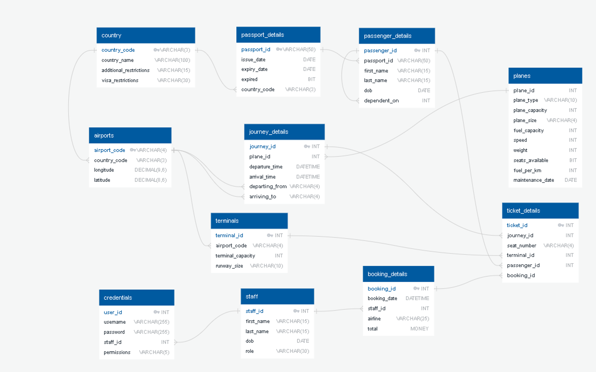

# Plane Project Database (DB) Guide

__The purpose of this document is to explain the order in which to carry out SQL queries when fulfilling the user stories.__ You can take the inputs from the user / assistant in any order you want, but you must query in this order, otherwise the DB will return errors due to foreign key and NOT NULL constraints. 

## DB Structure

To abstract querying this DB in python, please refer to the `DB_struture_plan.xlsx` file, which explicitly states the type inputs required in python, e.g `airport_code : STRING max, length = 4, upper,alpha`

## User Stories
### 1. As an airport assistance I want to be able to create a passenger with a name and Passport number so that I can add them to the flight. 

__you must insert passport details before personal info like age / name etc.__ Also passport number = passport_id because by definition passport numbers are unique. 

- take user's passport number / `passport_id`
- check whether it exists in in `passport_details` table
    - if it exists but `expired == True`, skip personal details info, but get new passport details from them. (see below)
    - if it exists and `expired == False` do nothing, they are already in the DB and their passport is valid for travel. 
    - if it doesn't exist:
        - create new passport record using their `passport_id`, `issue_date`, `expiry_date`, False, `country_code` for issuing country. 
        - take their personal details, and create a record in the `passenger_details` table, you need their `passport_id`, 

### 2. As an airport assistant I want to be able to create flight_trip with specific destination
- Flight trip details are stored in the `journey_details` table. 
- check which planes are available using an `OUTER JOIN` to see which planes don't have trips scheduled for your desired departure time. 
- To make an entry in this table, you need `plane_id` from the `planes` table of the plane which will make this trip
- you also need `arriving_to`departing_from` columns which are foreign keys to the `airport_code' of the airports at the start and end of the journey. 
- and finlly you need to enter a `departure_time` and `arrival_time` in the format `YYYY-MM-DD HH:MM`.

### 3. As an airport assistant I want to be able to assign and or change a plane to my flight_trip, input my password, so I can handle the problem

### 4. As an airport assistant I want to be able to add passengers to flight_trip so that I can sell the tickets to them

### 5. As an airport assistant I want to be able to generate a flight_attendees_list_report that lists passenger's names and passports so that I can check their identity

